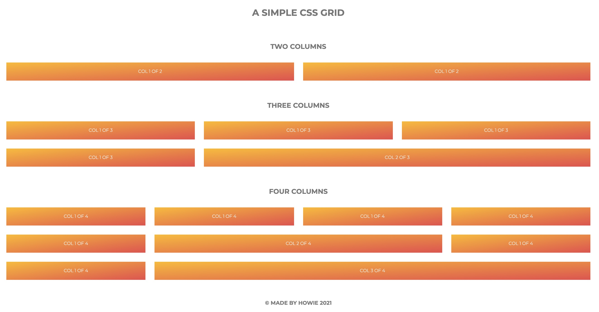

# Build a simple grid system with float

Old school, but still useful.



## Keywords

grid, float, div, row, col, clearfix, css attribute selector

## Tricks

1. Center a block element

```css
margin: 0 auto;
```

2. clearfix

```sass
@mixin clearfix {
  &::after {
    content: "";
    display: table;
    clear: both;
  }
}
```
